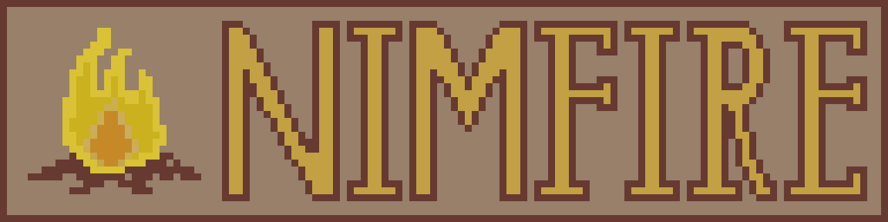

**Nimfire** (Nim Campfire) is small GUI/game library inspired by PyGame and Nigui,
using gl*FB and GLFW libraries to render window and let you draw.  
While it is mostly my learning project, I'd love to see it becoming something bigger
in the future - I will try to update is regularly, so it should not be abandoned
anytime soon.

### Installation
To install the library, simply run such command in terminal:
```
nimble install https://github.com/Toma400/Nimfire
```

### Usage
Initialising basic window is done using `initWindow` procedure. After that, you will
be able to control program loop and window closing:
```nim
import nimfire

var w = initWindow((800, 600), "Nimfire")

while w.tick():
  w.update()

w.finish()
```

You can also draw on canvas easily:
```nim
import nimfire/colors
import nimfire/draw
import nimfire

var w = initWindow((800, 600), "Nimfire")

while w.tick():
  w.drawRect((0, 0), (250, 250), PURPLE)
  w.update()

w.finish()
```
You can look at `examples/drawing` and `examples/rect_management` for more detailed
documentation on how you can use drawing with the library.

Aside of drawing shapes, Nimfire allows you also to use PNG images, further explained
in `examples/images` file:
```nim
import nimfire/image
import nimfire

var w = initWindow((800, 600), "Nimfire")
var i = newImage("nimfire.png")

while w.tick():
  w.drawImage(i, (10, 10))
  w.update()
  
w.finish()
```
And you can also handle user input:
```nim
import nimfire/input
import nimfire

var w = initWindow((800, 600), "Nimfire")

while w.tick():
  if w.getKeyPressed(KEY.SPACE):
    echo "Space just got used!"
  w.update()
  
  if w.getMousePressed(LEFT):
    echo "Mouse coordinates are: " & w.getMousePos()
  
w.finish()
```
For more code examples, visit `examples` folder. You can also look at `examples/apps`
for tutorial apps done step by step to showcase more abstract use of Nimfire.  
Additionally, module functions are slowly documented in [this](examples/functions.md)
Markdown file.

---
### Features
Currently, this is Nimfire's scope:
- [x] Creating app and controlling window
  - [x] Setting basic data (res, title) 
  - [x] Drawing shapes
    - [x] Exporting shapes into graphical files
- [x] Input control `mostly`
  - [x] Keyboard control
    - [x] Getting keyboard key being pressed
  - [x] Mouse control
    - [x] Recognising mouse input
    - [x] Getting mouse position on screen
  - [ ] Saving user input as data (listening to sequence of keys)
- [x] Image management `simple`
  - [x] Render image on screen
  - [x] Save images
  - [ ] JPG/SVG/BMP formats
  - [ ] More Image manipulation features
    - [ ] Resize images
    - [ ] Nesting Image type into each other
- [ ] Text management
  - [ ] Drawing text on screen
    - [ ] Size properties
    - [ ] More advanced features (multiline text)
  - [ ] Font support
- [ ] QoL
  - [ ] Holders for images/rects/sounds that let you access them by ID from Window
  <!-- use .mitems() for iterating over loop while making vars mutable
       can be pretty beneficial for iterating over holder items -->
- [ ] Sound management
  - [ ] Playing & stopping sound
  - [ ] WAV/FLAC/OGG/MP3 formats
  - [ ] Managing multiple channels (parallel sounds playing)
- [ ] UI
  - [ ] Buttons
  - [x] Progress bars
  - [ ] Sliders (vertical/horizontal)
  - [ ] Scrolling slider (vertical/horizontal)
  - [ ] Text fields
    - [ ] Single-row box
    - [ ] Multi-row box
  - [ ] Lists
    - [ ] Comboboxes
    - [ ] Bulletboxes
    - [ ] Listboxes
- [ ] QoL abstractions
  - [ ] Delta clock object
  - [ ] Optional Event system

Look at [changelog](changelog.md) if you want to see details.

---
### Note
Nimfire is learning project, and as such, may contain more bugs, performance issues
and problems overall than matured library.  
It is by no means stable or ready for development of games or software, and I hold
no promise to maintain it if I lose my motivation and will.

That said, I really want to do as much as I can with Nimfire, so it's not like this
lib will disappear soon. Just take in mind that until it becomes important utility
for my own gamedev, I do it as fun side-project, with all good and bad coming with
such status.

---
### Socials

<tr>
        <td colspan="2" align="center">
            <a href="https://linktr.ee/toma400"></a>
            <a href="https://discord.gg/GbTw9KqnrE"></a>
        </td>
</tr>

### Licensing
While library is *All Rights Reserved* for now (I'm quite lazy for libraries), it will
be changed soon. For now you are allowed to use the library for any personal project
that is not commercial in any way.

### Project made using Nimfire
#### 🎨 [Drawfire](https://github.com/Toma400/Drawfire) - simple drawing app

<!-- TODO
  - nested rects (for GUI)
    // - I'd say it should be exactly 'ref of Rect' with new addition being
         dict/list of rects inside & special drawing system that calls drawing
         of inside rects afterwards and with relative position
    // - a way to nest Rects inside Rects? (needs adjusting matrix accordingly)
  - simplegui button
  - simplegui progress bar
  - text using Pixie's "fillText" with possibility to have clear borders
    (https://github.com/treeform/pixie/tree/523b364fcaa288d23ecb3f34c795da97d3637117#text)
    + look at textspans, as they would be neat both for Nimfire & MarXDown
      (https://github.com/treeform/pixie/tree/523b364fcaa288d23ecb3f34c795da97d3637117#text-spans)

  - resize image
  - jpg & svg & bmp formats supported?

  - creating button (nimfire/ui) that is manageable?
    - creating 'buttons' element in Window that button can subscribe to?
      this way you could not need variables to be passed, as you would
      simply manage it by calling from Window object by ID or sth
  - getting sound and letting it play (possibly on several channels, so they
    can be played together and managed by it?)
    ::: https://github.com/oprypin/nim-csfml
    ::: https://github.com/treeform/openal (pure Nim!)
    ::: https://github.com/treeform/slappy (OpenAL wrapper? More C!)
  - holders for Image, Rect and other elements via either Window or
    separate structure? Would work as Table of [ID:str, T] and could
    handle objects for further reference
-->